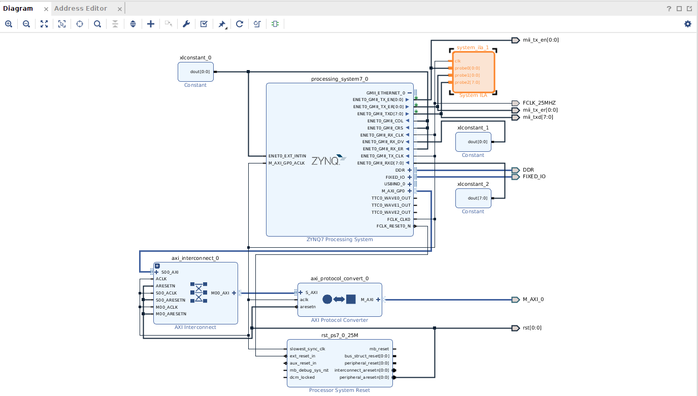
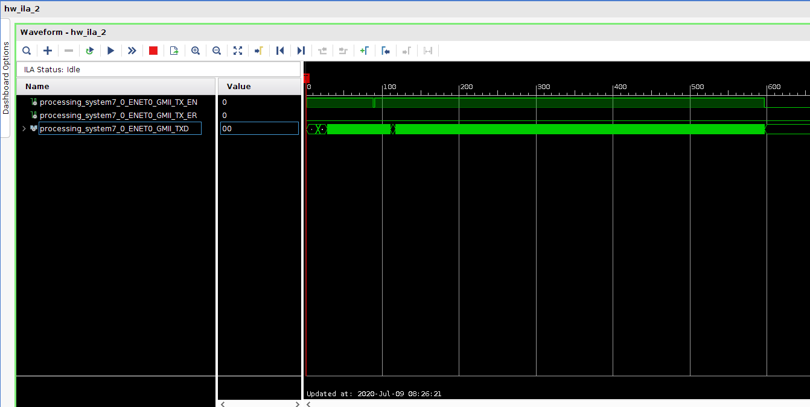
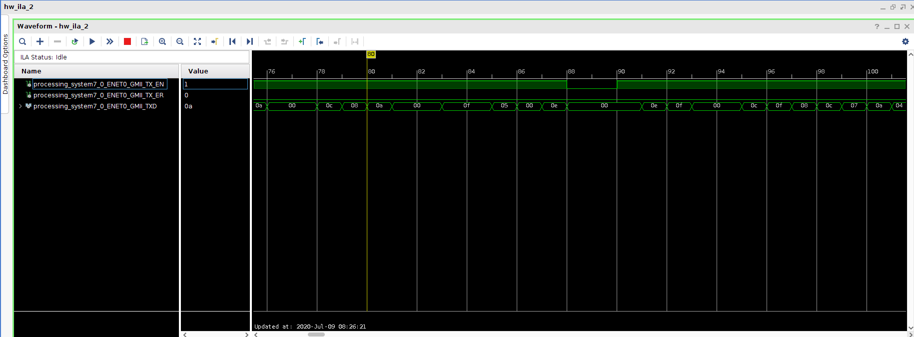

# MII signal bug in Xilinx FPGA

The main goal of this article to give the general information about
**Ethernet packets** and **MII** concept, and demonstrate a bug that I have
recently faced while working on **MII signals** in Vivado, with the architecture
that I build.

## General information

The **MII (Media-Independent Interface)** was defined as a standard interface
which connects **MAC** and **PHY** to each other. This interface is standardized
by **IEEE 802.3u** protocol. In order to understand MII concept, first of all,
we should comprehend **Ethernet frame** concept. In this blog, **packet** and
**frame** have the same meaning.

### Ethernet frames

Ethernet frames can be transformed from MAC to PHY via MII signals. Standard
Ethernet frames consist of `Preamble`, `Start of Frame Delimiter`,
`Ethernet Headers`, `Data`, which is protocol-specific and finally
`CRC (Cyclic Redundancy Check)` parts. There are two layer types for IEEE 802.3
protocol Ethernet packets and **Layer 1 Ethernet packet** which is important for
the architecture that I built is shown below [^1f]:

```text
 0                   1                   2                   3  
 0 1 2 3 4 5 6 7 8 9 0 1 2 3 4 5 6 7 8 9 0 1 2 3 4 5 6 7 8 9 0 1
+-+-+-+-+-+-+-+-+-+-+-+-+-+-+-+-+-+-+-+-+-+-+-+-+-+-+-+-+-+-+-+-+
|                            Preamble                           |
+                                               +-+-+-+-+-+-+-+-+
|                                               |Frame Delimiter|
+-+-+-+-+-+-+-+-+-+-+-+-+-+-+-+-+-+-+-+-+-+-+-+-+-+-+-+-+-+-+-+-+
|                        MAC Destination                        |
+                               +-+-+-+-+-+-+-+-+-+-+-+-+-+-+-+-+
|                               |                               |
+-+-+-+-+-+-+-+-+-+-+-+-+-+-+-+-+                               +
|                           MAC Source                          |
+-+-+-+-+-+-+-+-+-+-+-+-+-+-+-+-+-+-+-+-+-+-+-+-+-+-+-+-+-+-+-+-+
|        Ethertype/Length       |                               |
+-+-+-+-+-+-+-+-+-+-+-+-+-+-+-+-+                               +
|                                                               |
+                       Payload(Variable)                       +
|                                                               |
+-+-+-+-+-+-+-+-+-+-+-+-+-+-+-+-+-+-+-+-+-+-+-+-+-+-+-+-+-+-+-+-+
|                              CRC                              |
+-+-+-+-+-+-+-+-+-+-+-+-+-+-+-+-+-+-+-+-+-+-+-+-+-+-+-+-+-+-+-+-+
|                                                               |
+                                                               +
|                        Interpacket Gap                        |
+                                                               +
|                                                               |
+-+-+-+-+-+-+-+-+-+-+-+-+-+-+-+-+-+-+-+-+-+-+-+-+-+-+-+-+-+-+-+-+
```

This figure is a general view of Ethernet packets. In an Ethernet frame, there
should be some starting bytes which PHY side can comprehend that a new packet
starts to be received. Therefore, for this purpose, `Preamble` and
`Start of Frame Delimiter` parts are utilized. In these parts, specified bytes
are sent to PHY (However, in some layers, which use **Layer 2 Ethernet frame**,
these parts are ignored for gaining more bandwidth.). These bytes are
**55 55 55 55 55 55 55 5D**, which last byte indicates the
`Start of Frame Delimiter` part and rest of them indicate `Preamble` part.

After these parts, MAC should transmit 6 byte `MAC destination IP`, which is for
specifying the ending point, and also its 6 byte `MAC source IP`, which is for
informing the end point about starting point. For example, for an
**ARP Ethernet frame**, `MAC destination IP` is **FF FF FF FF FF FF** in order
for MAC to know many PHY IP addresses (destination IP addresses) as much as
possible.

Following these starting bytes, for IEEE 802.3 protocol, 2 bytes
`Ether type/Length` part should be sent. If `Ether type/Length` value is less
than 1500, the value shows the payload part size/length. Otherwise, it shows the
`Ether type/Length` of the Ethernet packet. For example, if `Ether type/Length`
part is **0x0800**, it means that the packet is an **IPv4 frame**, if it is
**0x0806**, the packet is an **ARP frame**… etc.

Before **FCS (Frame Check Sequence)**, or `CRC` (Same meaning but FCS name is
specified for Ethernet frames.), `Payload` part which contains protocol’s
headers (**UDP checksum**… etc.), main data, and **padding bytes** (if frame
length is not long enough) should be transmitted.  

At last, 4 bytes `CRC/FCS` information is sent by MAC. `CRC` is utilized for
being sure that `MAC addresses`, `Ether type/Length` and `Payload` parts are
correctly received by PHY side. For calculating it, some algorithms, which are
not in our scope are used. For Ethernet packets, specifically, **CRC32 BZIP2**
is used [^1f]. Main calculations do not change among `CRC` types, but only
parameters used for calculating `CRC` may differ.

Some specified parts, which can be seen in the figure above, are sent and
finally, according to the **Layer 1 Ethernet packets**, `Inter-Packet Gap` phase
starts. In this part, MAC transmits **idle bytes** to PHY so that PHY can
receive previous packet and make some processes on the packet before new packet
arrives. Briefly, MAC side should give some time to PHY side. In the figure,
`inter-packet gap` is shown as **12 octets** (bytes) but with respect to
**Ethernet speed**, this number can change. Full Ethernet speed-inter packet gap
duration list can be found below [^3f]:

| Ethernet Speed | Least Interpacket Gap Duration |
|:--------------:|:------------------------------:|
|   10 Mbits/s   |             9.6 us             |
|   100 Mbits/s  |             0.96 us            |
|   1 Gigabit/s  |              96 ns             |
|  2.5 Gigabit/s |             38.4 ns            |
|   5 Gigabit/s  |             19.2 ns            |
|  10 Gigabit/s  |             9.6 ns             |
|  25 Gigabit/s  |             3.84 ns            |
|  40 Gigabit/s  |             2.4 ns             |
|  50 Gigabit/s  |             1.92 ns            |
|  100 Gigabit/s |             0.96 ns            |
|  200 Gigabit/s |             0.48 ns            |
|  400 Gigabit/s |             0.24 ns            |

!!!Note
    In my architecture, `100 Mbits/s speed` is used. Therefore, interpacket
    gap should be at least `0.96 us` which means at least **96 bits** (12
    octets).

The summary of Ethernet packet concept is referred above. So as to close to the
main problem, we should comprehend MII concept as well.

### MII signals

**Standard MII** signals transfer specified Ethernet frame using
**4-bit (nibbles)** with full-duplex way. However, by the time, different MII
concepts were utilized in order to reduce signals and increase speed [^2f].
**RMII** (Reduced Media-Independent Interface), **GMII** (Gigabit
Media-Independent Interface) and **RGMII** (Reduced Gigabit Media-Independent
Interface) are different variants of MII so as to improve signals or speeds.
However, I have utilized standard MII to achieve my goal. In the standard MII,
there are some **transmitter** and **receiver** signals which are demonstrated
below [^2f]:

<!--markdownlint-disable MD013-->
| Signal Name |                                   Description                                  | Direction |
|:-----------:|:------------------------------------------------------------------------------:|:---------:|
|    TX_CLK   |                                 Transmit clock                                 | MAC → PHY |
|     TXD0    |             Transmit data bit 0 which carries ethernet packet data             | MAC → PHY |
|     TXD1    |             Transmit data bit 1 which carries ethernet packet data             | MAC → PHY |
|     TXD2    |             Transmit data bit 2 which carries ethernet packet data             | MAC → PHY |
|     TXD3    |             Transmit data bit 3 which carries ethernet packet data             | MAC → PHY |
|    TX_EN    | Transmit enable signal which tells PHY that there are MII signals on their way | MAC → PHY |
|    TX_ER    |    Transmit error signals which tells PHY there is a nibble error on its way   | MAC → PHY |
|             |                                                                                |           |
|    RX_CLK   |                                  Receive clock                                 | PHY → MAC |
|     RXD0    |             Receiver data bit 0 which carries ethernet packet data             | PHY → MAC |
|     RXD1    |             Receiver data bit 1 which carries ethernet packet data             | PHY → MAC |
|     RXD2    |             Receiver data bit 2 which carries ethernet packet data             | PHY → MAC |
|     RXD3    |             Receiver data bit 3 which carries ethernet packet data             | PHY → MAC |
|    RX_EN    |        Receiver enable signal which MAC knows MII signals are sent to it       | PHY → MAC |
|    RX_ER    |     Receiver error signals which MAC knows the MII signals have data errors    | PHY → MAC |
|     CRS     |           Carrier sense signal which is not used in the architecture           | PHY → MAC |
|     COL     |          Collision detect signal which is not used in the architecture         | PHY → MAC |
<!--markdownlint-enable MD013-->

Finally, after some general information, it is time to explain the architecture
that is built.

## Architecture

In fact, the architecture is very easy to construct and run. Below, the block
design is shown:



!!!Warning
    In the figure, some signals such as `M_AXI_GP0`, `ENET0_GMII_RX_*` and also
    some blocks such as `AXI Interconnect`, `Processor System Reset`,
    `AXI Protocol Converter` can be seen. These signals and blocks are nothing
    to do with `ENET0_GMII_TX_*`. They do not affect TX side in any ways.

As can be seen from the figure, there are just four signals that should be taken
into consideration. These signals are `ENET0_GMII_TX_EN`, `ENET0_GMII_TX_ER`,
`ENET0_GMII_TXD`, `ENET0_GMII_TX_CLK`. Because the speed is chosen as 100
Mbits/s, 25 MHz clock is generated via `ZYNQ Block` and connected to
`ENET0_GMII_TX_CLK`. Other **TX signals**** are connected to `ILA Block` to make
some chipscope tests.

Moreover, I have utilized **Linux Driver** for setupping transmission with
**ZYNQ GEM**. In a more understandable language, I have used Linux Driver so
that **ARM side** can generate Ethernet packets and send them via MII interface.

As a result, after building this, generating bitstream and programming device, I
have started to observe MII signals and comprehend how they are sent via ILA.
However, in some packets, I have found a **bug** that is explained in the next
part.

## The bug

According to MII Protocol Specification, during `TX_EN` signal assertion,
receiver side takes the nibbles (for standard MII). When `TX_EN` signal goes
low, receiver side takes the entire packet until that time and makes some
process (such as calculating **CRC** and comparing with the received one) on the
packet during **interpacket gap time**. Therefore, when `TX_EN` signal is not
high after some transmission, receiver side understands that the packet is
finished and it is time to make some processes.

However, in my architecture, sometimes, in the middle of packet, `TX_EN` signal
goes low for a single clock cycle and then again goes high. So, it does not stay
low for **24 clock cycles (12 octets)** after it goes low. Also, so that I am
sure that it is a bug, I have written a module that writes MII data to **BRAM**.
For bug case, I have calculated CRC without including the case that `TX_EN` goes
low and I have compared the calculated CRC with the received CRC. They were
exactly the same.

This kind of bug can result in some errors in receiver side because people write
codes according to the specifications and if you do not satisfy them, there
always occur some errors and bugs. I have put some screenshoots from **ILA** to
comprehend the problem more easily:





As can be inferred from the pictures, somewhere in the middle of the entire MII
packet, `TX_EN` goes low. We can say that a packet transmission has finished and
a new one has started but they are not two seperate packets according to my CRC
calculations. Because they unite a packet, `TX_EN` should not be disasserted
even for a single clock cycle.

Finally, for this bug, I have posted a detailed question on
[Xilinx Forum](https://forums.xilinx.com/t5/Ethernet/MII-Signals-Problem-on-ILA/m-p/1126290#M28573)
but Xilinx employees do not really give attention to the **bug**. That is why
there is no solution for this problem.

[^1f]: [https://en.wikipedia.org/wiki/Ethernet_frame](https://en.wikipedia.org/wiki/Ethernet_frame)
[^2f]: [https://en.wikipedia.org/wiki/Media-independent_interface](https://en.wikipedia.org/wiki/Media-independent_interface)
[^3f]: [https://en.wikipedia.org/wiki/Interpacket_gap](https://en.wikipedia.org/wiki/Interpacket_gap)
