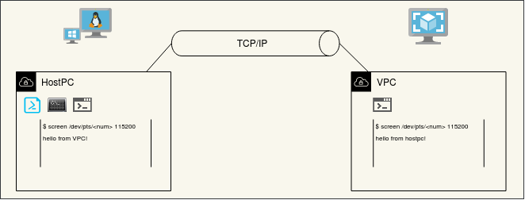
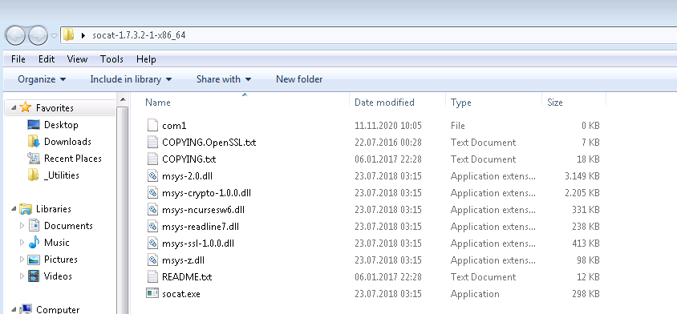
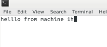
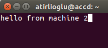

# Serial data communication over TCP

## Why would you need serial over ethernet ?

A serial device on remote PC can be viewed as directly connected to your PC with
serial over ethernet.

Two applications on different PCs talk over serial ports as if applications
directly connected through serial ports. This could be sensible if you are
testing your application before directly interfacing with the real serial
device. Check this link[^1f] to see similar use case within same PC.  

In my case this is very handy since I have an evaluation board Xilinx ZC706 on
remote workstation. It needs at least serial connection and JTAG connection for
remote development on this board. Luckily, Xilinx provides hw_server concept to
access JTAG over TCP connection. Serial over ethernet concept eases the serial
communication part with ZC706's ARM CPU.

What is your story ?

## Other commercially available solutions

Google search for "serial over TCP solutions" lists plenty of commercial
applications. Some of them may provide extensively capable solutions and worth
to give money but anyway in most cases **socat** will do the job. I will not discuss
these applications any further but you can check out this link[^2f].

## socat

socat is a multi purpose relay in short, it forwards communications. It has no
graphical user interface, users will interface with socat through command line.
Therefore, it is lightweight and easy to install.

socat can be used for ethernet port forwarding, serial COMPORT forwarding and
forwarding ports between ethernet and serial ports. For more detailed definition
and other capabilities you can refer to socat man page[^3f].

socat can run both on GNU Linux and Windows operating systems. Meaning of it is
that forwarding can also occur between machines based on these two operating
systems.

In this tutorial, Machine 1 is called HostPC which is a physical machine with
Windows 7 or Ubuntu 16.04. Machine 2 is Virtual PC running on VirtualBox 6.1
within the same local area network with HostPC. Connection diagram is shown
below.



## Step by step serial data forwarding over ethernet

### 1. Install socat

#### On Ubuntu

Install socat with `apt` or `apt-get` package manager.

```console
$ sudo apt install socat
```

#### On Windows

Download zip file from sourceforge[^4f]. Extract it and simply run socat.exe
when required in the following steps within the extracted folder or add
socat.exe to PATH.

The folder structure is shown below.



### 2. Learn IP address of Machine 1

It is required to know Machine 1 ip address to start TCP connection. Simply use
`ifconfig` or `ipconfig` on command line to learn ip address in the network.

```console
$ ifconfig
<iface_name>    Link encap:Ethernet  HWaddr <HWaddr>  
                inet addr:<ip address>  Bcast:<Bcast>  Mask:<Mask>
                inet6 addr: <inet6 addr> Scope:Link
                UP BROADCAST RUNNING MULTICAST  MTU:1500  Metric:1
                RX packets:<num> errors:0 dropped:0 overruns:0 frame:0
                TX packets:<num> errors:0 dropped:0 overruns:0 carrier:0
                collisions:0 txqueuelen:<num>
                RX bytes:<num> (<num> MB)  TX bytes:<num> (<num> MB)
```

In this tutorial `<ip address>` of machine 1 is `192.168.10.200`.

### 3. Create virtual serial port to forward and listen on machine 1

Start listening on TCP port of your choice for this tutorial it is port 6665.

On Ubuntu:

```console
$ socat -d -d pty,raw,echo=0 TCP4-LISTEN:6665
2020/11/29 15:39:49 socat[29476] N PTY is /dev/pts/6
2020/11/29 15:39:49 socat[29476] N listening on AF=2 0.0.0.0:6665
```

!!! Info Just use `/dev/ttyS<num>` or `/dev/ttyUSB<num>` for physical serial
    ports instead of `pty`. As an example `/dev/ttyS0` or `/dev/ttyUSB1`.

Machine 1 will listen for TCP connections and forward communication to/from
virtual port it is just created in this case `/dev/pts/6`. Note that created
virtual serial port number can differ for your case.

If you are on Windows OS, run the command below within socat.exe folder.

```powershell
> .\socat.exe -d -d -d TCP4-LISTEN:6665,reuseaddr /dev/com<number>
```

!!! Info
    On Windows COMPORTs can be addressed with  `/dev/com<number>` similar
    to Ubuntu. For example, `/dev/com1` and `/dev/com3` for physical serial interfaces.

### 4. Create virtual serial port to forward on machine 2

Start TCP connection from machine 2 to machine 1 with the IP and port of machine
1.

```console
$ socat -d -d TCP4:192.168.10.200:6665 pty,raw,echo=0
2020/11/29 15:40:48 socat[14626] N opening connection to AF=2 192.168.10.200:6665
2020/11/29 15:40:48 socat[14626] N successfully connected from local address AF=2 10.0.2.15:48544
2020/11/29 15:40:48 socat[14626] N PTY is /dev/pts/18
2020/11/29 15:40:48 socat[14626] N starting data transfer loop with FDs [5,5] and [6,6]
```

Machine 2 will start TCP connection and forward communication to/from virtual
port it is just created in this case `/dev/pts/18`.

### 5. Open Ports on both machines with any serial port applications

Start a new terminal window and open virtual serial ports just created. You can
use serial port terminal application of your choice. In the example below
`screen` is used.

On machine 1, type:

```console
$ screen /dev/pts/18 115200
```

On machine 2, type:

```console
$ screen /dev/pts/6 115200
```

!!! Info
    You won't need to open serial port with an application like `screen`
    for physical serial interfaces.

### 6. Start Sending Bytes

Just type something on your keyboard and see if you can send messages between
machine 1 and machine 2.

&emsp;&emsp;&emsp;&emsp;

[^1f]:https://medium.com/@karthiks1701/virtual-serial-ports-hack-for-communication-between-local-scripts-883fda0f60f4
[^2f]:https://www.virtual-serial-port.org/article/best-serial-over-ethernet-tools/
[^3f]:https://linux.die.net/man/1/socat
[^4f]:https://sourceforge.net/projects/unix-utils/files/socat/1.7.3.2/
