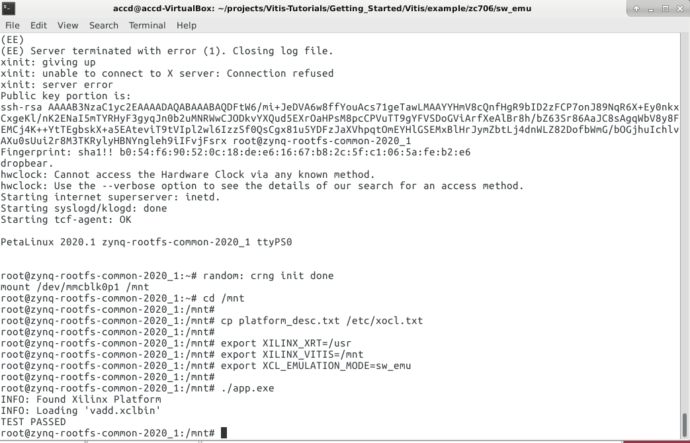

# Getting Started to Vitis Acceleration Flow with Zynq 7000

This tutorial will include beginner friendly steps to run your first accelerator
on FPGA. We all know, sometimes it is just hard to get start learning things from
vendor documentations. This tutorial will be more beneficial when used in
conjunction with the official Xilinx tutorial[^1f] published on github. Note that
Xilinx tutorial targets Zynq Ultrascale+ ZCU102 and Alveo U200 boards for
embedded flow and PCIe attached flow respectively.

There are two different device definitions in Xilinx. One is **embedded
devices**[^3f],  other one is **data center accelerator cards**[^4f]. Embedded
device can work standalone. It hosts CPU and FPGA. On the other hand, data
center accelerator cards needs to be attached to PC through PCIe interface. CPU
on your host PC will manage these FPGA cards. This tutorial will cover embedded
device flow with a Zynq 7000 series FPGA board.

Unlike Xilinx tutorial on github, this tutorial targets ZC706[^2f] evaluation
board which hosts Zynq 7000 Series SOC. This requires some changes on tutorial source
files provided by Xilinx.

Some essential terms could be helpful to know before starting to Vitis
acceleration flow.

| Term               | Description |
| ------------------ | ----------- |
| Host               | CPU that runs main function, handles management and other possible sequential tasks, functions etc. |
| Device             | FPGA or board that accelerates functions which are called from host, mostly used in OpenCL definitions for GPU and FPGA                   |
| Kernel             | Region on FPGA that runs functions implemented for FPGA programmable logic, it is also called computing unit                      |
| Accelerator        | Used interchangeably with kernel and device, in general it provides offloading of CPU                         |

## Vector Add Example

The example we will run in this tutorial is a vector addition example. Two
vectors that are build up with 4096 random numbers will be summed up on both
host which is Zynq Cortex A9 CPU and in vector_add kernel which is programmed to
Zynq programmable logic. Results from device and from host will be then compared
within host. Success and fail result will be returned on terminal screen of host.

## Required Tools and Files

### 0. GNU/Linux Operating System

This tutorial uses Ubuntu. Vitis documentation[^5f] lists the
supported OSes as shown below.


You can view your Ubuntu version on console with `cat /etc/os-release`. I prefer
to use Ubuntu 16.04. Note that Ubuntu version 16.04.7 is not among supported OSes.
Vitis installation will be mentioned in the next step freezes at some point of
installation for this reason.

```console
$ cat /etc/os-release
NAME="Ubuntu"
VERSION="16.04.7 LTS (Xenial Xerus)"
ID=ubuntu
ID_LIKE=debian
PRETTY_NAME="Ubuntu 16.04.7 LTS"
VERSION_ID="16.04"
HOME_URL="http://www.ubuntu.com/"
SUPPORT_URL="http://help.ubuntu.com/"
BUG_REPORT_URL="http://bugs.launchpad.net/ubuntu/"
VERSION_CODENAME=xenial
UBUNTU_CODENAME=xenial
```

To trick the installer, set your OS version to one of the closest supported one
with your OS. Open with the text editor with command below and change `16.04.7`
to  `16.04.6`.

```console
$ sudo gedit /etc/os-release
```

Make sure that you have required software packages or run the command below to
install them.

```console
$ sudo add-apt-repository ppa:xorg-edgers/ppa sudo apt-get updatesudo apt-get install libgl1-mesa-glxsudo apt-get install libgl1-mesa-drisudo apt-get install libgl1-mesa-devsudo add-apt-repository --remove ppa:xorg-edgers/ppasudo apt install net-toolssudo apt-get install -y unzipsudo apt install gccsudo apt install g++sudo apt install pythonln -s /usr/bin/python2 /usr/bin/python
```

You can now run the installer in the following step.

### 1. Vitis

Go Xilinx download page <https://www.xilinx.com/support/download.html>

I prefer downloading **Linux Self Extracting Web Installer**.


Make the bin file executable ```$ chmod +x Xilinx_Unified_2020.1_0602_1208_Lin64.bin```
and run the installer ```$ ./Xilinx_Unified_2020.1_0602_1208_Lin64.bin```.

Follow the installation defaults. After the installation Vivado, Vitis and other
xilinx tools should be under `/opt/tools/Xilinx/` directory.

### 2. Xilinx Runtime(XRT)

Go Xilinx download page <https://www.xilinx.com/support/download.html> and open
`Vitis Embedded Platforms` tab.


Download `XRT 2020.1` and install XRT with double click to `.deb` file or run
the installation command ```$ sudo apt install <filename>.deb```. Now, you should
see `/opt/xilinx/xrt/` directory created and **XRT** is installed.

### 3. Embedded Platform Files for ZC706

Go Xilinx download page <https://www.xilinx.com/support/download.html> and open
`Vitis Embedded Platforms` tab again.


Download ZC706 base platform zip file. Extract the zip file to location `/opt/xilinx/platforms/`.
Now, you should have file `xilinx_zc706_base_202010_1` under this directory.

### 4. Prebuilt Petalinux Kernel and Root File System

We will use prebuilt kernel and rootfs for simplicity. Go Xilinx download page
<https://www.xilinx.com/support/download.html> and open `Petalinux` tab.


Download `ZYNQ Common Image` and extract it to `/opt/tools/Xilinx/xilinx-zynq-common-v2020.1/`.
Run ```sh sdk.sh``` script again in this folder. This script should create **sysroot**
under `/opt/petalinux/2020.1/`.

### 5. Tutorial Files

In your home directory create `projects` folder to download tutorial files there.

* Within `projects`, clone tutorial files from github repository ```$ git clone https://github.com/aniltirli/Vitis-Tutorials.git```

* Checkout to branch patch-1 ```$ git checkout patch-1```

* Tutorial files should reside under `Vitis-Tutorials/Getting_Started/Vitis/example/zc706`.

## Setting Environmental Variables

We Vitis environmental setting to be able to use required tools and scripts. Run
the commands below.

```console
$ source /opt/tools/Xilinx/Vitis/2020.1/settings64.sh
$ source /opt/xilinx/xrt/setup.sh
$ unset LD_LIBRARY_PATH
$ source $XILINX_VITIS/data/emulation/qemu/unified_qemu_v4_2/environment-setup-aarch64-xilinx-linux

$ export LIBRARY_PATH=/usr/lib/x86_64-linux-gnu

$ export PLATFORM_REPO_PATHS=/opt/xilinx/platforms
$ export ROOTFS=/opt/tools/Xilinx/xilinx-zynq-common-v2020.1
$ export SYSROOT=/opt/petalinux/2020.1/sysroots/cortexa9t2hf-neon-xilinx-linux-gnueabi
$ source /opt/petalinux/2020.1/environment-setup-cortexa9t2hf-neon-xilinx-linux-gnueabi
```

!!! Tip
    Commands above lasts only for a console session. Create script file
    `vitis_settings.sh` and copy commands above there. Whenever you need to set
    environment for Vitis acceleration flow you can run this script ```$ sh vitis_settings.sh```.

## Running Emulations

These steps are similar to steps mentioned in Xilinx tutorial embedded flow.

### 1. Software Emulation

Hardware accelerator code(`Vitis-Tutorials/Getting_Started/Vitis/example/src/vadd.cpp`)
and host code(`Vitis-Tutorials/Getting_Started/Vitis/example/src/host.cpp`) is
compiled for only Zynq Cortex ARM A9 processor. Emulation will run on QEMU virtualizing
Zynq on your Ubuntu. This simulation will provide fast error detection for syntax
and behavioral errors.

Under `Vitis-Tutorials/Getting_Started/Vitis/example/zc706/sw_emu/`, you
will find `build_and_run.sh` run this script ```$ sh build_and_run.sh```.

After QEMU boots run the commands below.

```console
$ mount /dev/mmcblk0p1 /mnt
$ cd /mnt
$ cp platform_desc.txt /etc/xocl.txt
$ export XILINX_XRT=/usr
$ export XILINX_VITIS=/mnt
$ export XCL_EMULATION_MODE=sw_emu
$ ./app.exe
```



!!! Warning
    If you get `ERROR: parted command not exist` error, add location of parted
    to PATH export ```$ export PATH=$PATH:/sbin``` or install parted
    ```$ sudo apt install parted```.

### 2. Hardware Emulation

Hardware accelerator code and host code is compiled for Zynq programmable logic
side and Zynq Cortex ARM A9 processor respectively. Emulation will run on QEMU which
is virtualizing Zynq on your Ubuntu. This simulation will take long but will provide
cycle accurate performance and profiling without needing to real physical hardware.

Under `Vitis-Tutorials/Getting_Started/Vitis/example/zc706/hw_emu/`, you
will find `build_and_run.sh` run this script ```$ sh build_and_run.sh```. After
QEMU booted, execute commands below on terminal screen.

```console
$ mount /dev/mmcblk0p1 /mnt
$ cd /mnt
$ cp platform_desc.txt /etc/xocl.txt
$ export XILINX_XRT=/usr
$ export XILINX_VITIS=/mnt
$ export XCL_EMULATION_MODE=hw_emu
$ ./app.exe
```


## Running Accelerator on ZC706

Under `Vitis-Tutorials/Getting_Started/Vitis/example/zc706/hw_emu/`, you
will find `build.sh` run this script ```$ sh build.sh```. This may take time to finish.
`package` folder should be created by the script. ZC706 will boot from SD card in
this tutorial. Switch SW11 on ZC706 board should look like below image for boot mode
SD.


### Creating SD card Image

Insert SD card to your PC and check its name with command.

```console
$ sudo fdisk -l
```

Most likely, SD card will be named **mmcblk0** and it's partitions will be printed
on console.

```console
$ sudo umount /dev/mmcblk0
```

After making sure it is the SD card you want to use, format and copy SD card image
***sd_card.img*** created with `build.sh` script. Write it to your SD card.

```console
$ dd if=/dev/mmcblk0 of=./package/sd_card.img
```

After these operations, remove and insert SD card to your PC, you should see
two partitions. One for root file system in ext4 format and the other one has
`BOOT.bin`, `app.exe` and other stuff.


Insert SD card to ZC706, power on the board and wait until it boots. Execute
commands below on ZC706 petalinux terminal screen.

```console
$ mount /dev/mmcblk0p1 /mnt
$ cd /mnt
$ cp platform_desc.txt /etc/xocl.txt
$ export XILINX_XRT=/usr
$ export XILINX_VITIS=/mnt
$ ./app.exe
```


## Modifications on host.cpp

```c++
// ------------------------------------------------------------------------------------
// Step 4: Check Results and Release Allocated Resources
// ------------------------------------------------------------------------------------
    bool match = true;
    int miss_counter = 0;
    for (int i = 0 ; i < DATA_SIZE ; i++){
        int expected = in1[i]+in2[i];
        if (out[i] != expected){
            std::cout << "Error: Result mismatch" << std::endl;
            std::cout << "i = " << i << " CPU result = " << expected << " Device result = " << out[i] << std::endl;
            match = false;
            miss_counter++;
            //break;
        }
        std::cout << "i = " << i << " CPU result = " << expected << " Device result = " << out[i] << std::endl;
    }
    std::cout << miss_counter << " results mismatched" << std::endl;
```


<!---Refs --->
[^1f]:https://github.com/Xilinx/Vitis-Tutorials/tree/master/Getting_Started/Vitis
[^2f]:https://www.xilinx.com/products/boards-and-kits/ek-z7-zc706-g.html#overview
[^3f]:https://www.xilinx.com/support/download/index.html/content/xilinx/en/downloadNav/embedded-platforms.html
[^4f]:https://www.xilinx.com/products/boards-and-kits/alveo.html
[^5f]:https://www.xilinx.com/support/documentation/sw_manuals/xilinx2020_1/ug1400-vitis-embedded.pdf
